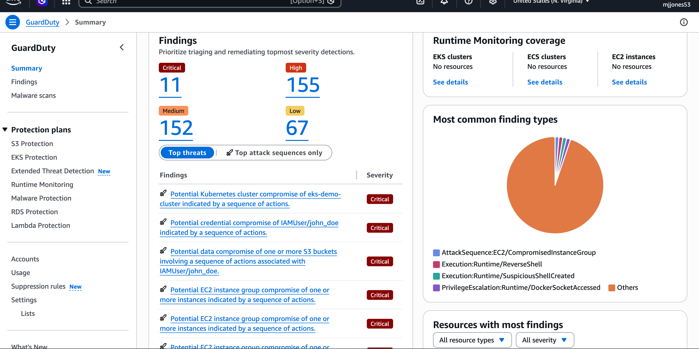
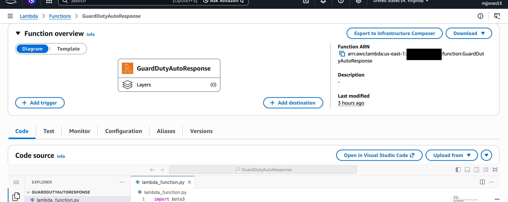
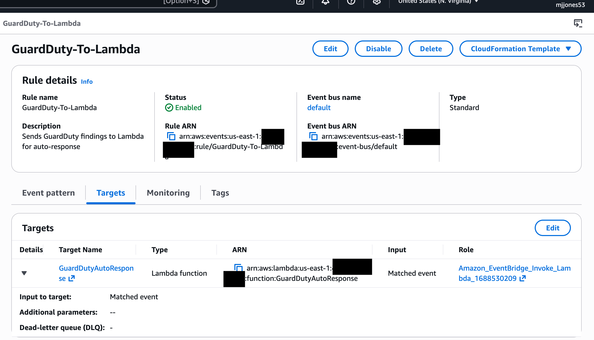
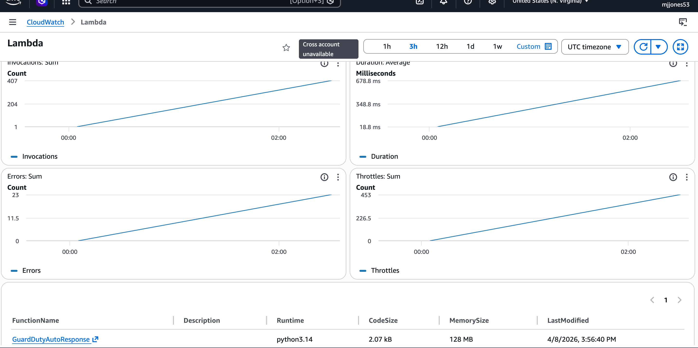
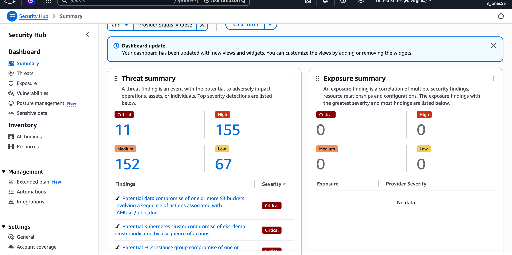
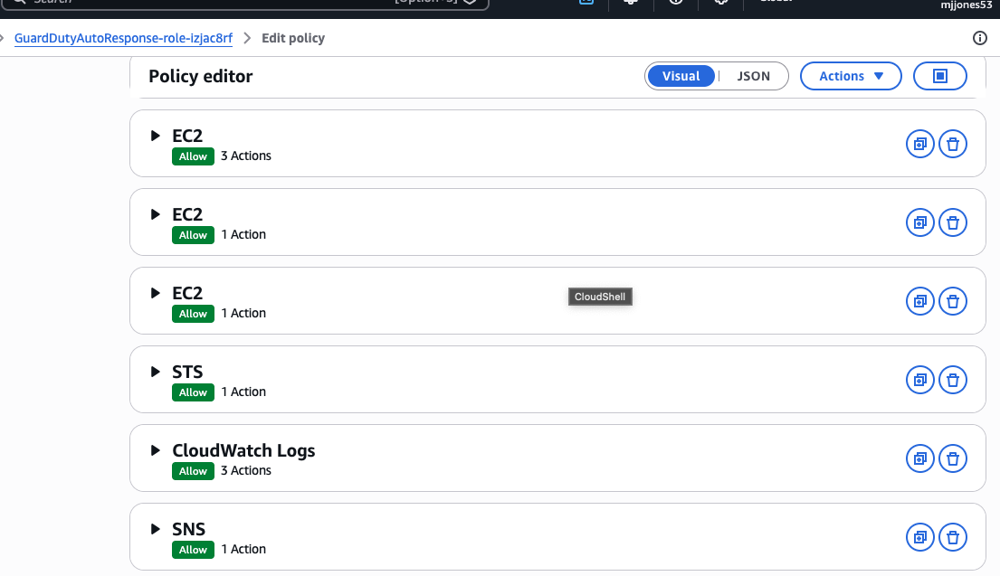
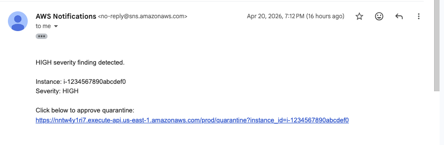
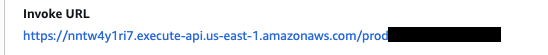
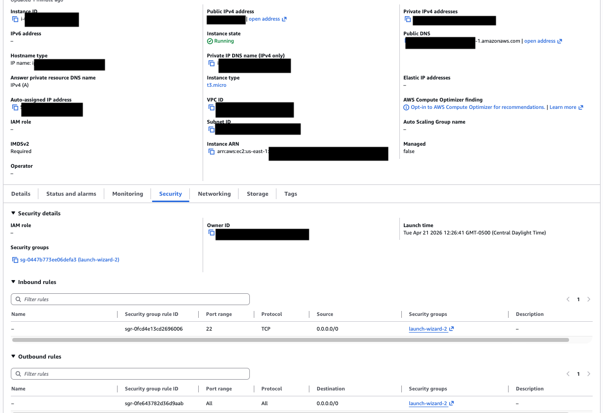
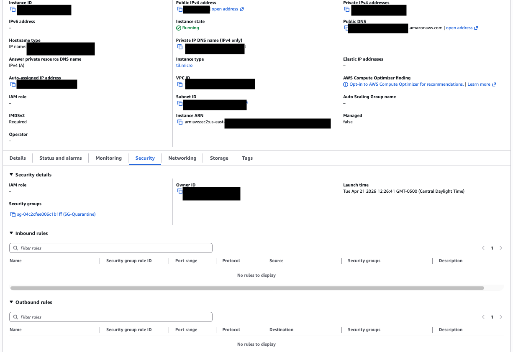

# GuardDuty Automated Incident Response

An automated cloud security pipeline built on AWS that detects 
threats and isolates compromised resources within seconds — 
with automated and human-approved response actions based on severity.

---

## Project Overview

This project simulates a real-world Security Operations Center (SOC) 
automated response workflow using native AWS security services.

When Amazon GuardDuty detects a threat, this pipeline performs actions based on severity:

LOW:
- Sends notification only

MEDIUM:
- Tags affected EC2 instance for investigation
- Sends alert notification

HIGH / CRITICAL:
- Sends approval request via SNS
- Requires human-in-the-loop approval before containment
- Upon approval, isolates the EC2 instance using a quarantine security group

Response time: near real-time detection with controlled remediation for high-risk actions.

**Response time: under 10 seconds from detection to isolation.**

---

## Architecture

GuardDuty (detects threat)
↓
Security Hub (aggregates findings)
↓
EventBridge (routes finding)
↓
Lambda (decision engine)
↓
SNS (notification / approval)
↓
(API Gateway - approval link)
↓
Lambda (quarantine execution)
↓
EC2 (isolated)

---

## Human-in-the-Loop Approval

High severity findings require explicit approval before remediation.

An SNS notification is sent containing a one-click API Gateway link. 
When clicked, the request triggers a Lambda function that performs 
instance quarantine.

This prevents accidental disruption of production workloads while 
maintaining rapid response capability.

---

## AWS Services Used

| Service | Role in Project |
|---|---|
| Amazon GuardDuty | Threat detection and finding generation |
| AWS Lambda | Automated response logic (Python 3.12) |
| Amazon EventBridge | Event routing from GuardDuty to Lambda |
| Amazon EC2 | Target resource being protected/isolated |
| AWS Security Hub | Centralized security findings dashboard |
| Amazon CloudWatch | Execution logs and audit trail |
| AWS IAM | Least privilege access control |
| Amazon SNS | Sends alerts and apprroval notifications |
| Amazon API Gateway | Provides secure approval endpoint |

---

## Security Practices

### Least Privilege IAM
The Lambda execution role is granted only the exact permissions 
required. Broad managed policies are intentionally avoided.

| Permission | Reason |
|---|---|
| ec2:DescribeInstances | Identify the VPC of the affected instance |
| ec2:CreateSecurityGroup | Create an isolated quarantine group |
| ec2:RevokeSecurityGroupEgress | Remove all outbound rules |
| ec2:ModifyInstanceAttribute | Attach quarantine group to instance |
| securityhub:BatchImportFindings | Report incident to Security Hub |
| sts:GetCallerIdentity | Retrieve account ID for ARN construction |
| logs:CreateLogGroup/Stream/PutLogEvents | Write execution logs |

CloudWatch access is scoped to this function's log group only.

### No Hardcoded Credentials
All AWS API calls use the Lambda execution role via IAM. 
No access keys or secrets exist anywhere in this codebase.

### Sensitive Data Excluded
A `.gitignore` is configured to prevent credentials, `.env` files, 
and key files from ever being committed.

---

## How to Deploy

### Prerequisites
- An AWS account
- AWS Console access
- GuardDuty and Security Hub enabled in us-east-1

### Steps
1. Enable GuardDuty in your AWS account
2. Enable Security Hub and connect GuardDuty as a data source
3. Create a Lambda function (Python 3.12) and paste `lambda/lambda_function.py`
4. Attach the IAM policy in `iam/least_privilege_policy.json` to the Lambda role
5. Create an EventBridge rule using the pattern in `eventbridge/event_pattern.json`
6. Set the EventBridge target to your Lambda function
7. Test using GuardDuty → Settings → Generate sample findings

---

## Testing

GuardDuty includes a built-in sample findings generator.

1. Go to GuardDuty → Settings → Generate sample findings
2. Navigate to CloudWatch → Log groups → `/aws/lambda/GuardDutyAutoResponse`
3. Confirm logs show isolation executed for HIGH severity findings
4. Navigate to Security Hub → Findings to confirm the report was posted

---

## Proof of Work

The screenshots below document the full pipeline running in a live 
AWS environment. Sample findings were generated using GuardDuty's 
built-in testing tool to simulate a real HIGH severity threat. 
All sensitive values including AWS account IDs and instance IDs 
have been redacted.

---

## Screenshots

| Step | Screenshot |
|---|---|
| GuardDuty enabled |  | GuardDuty enabled and actively monitoring the AWS account for threats 24/7 |
| Lambda function deployed |  | Lambda function deployed with Python 3.12 — contains the full automated response logic |
| EventBridge rule configured |  | EventBridge rule routing GuardDuty findings directly to the Lambda function |
| CloudWatch logs showing isolation |  | CloudWatch logs confirming Lambda executed and isolated the compromised instance |
| Security Hub finding posted |  | Security Hub finding posted automatically by Lambda after incident response completed |
| IAM least privilege policy |  | Custom least privilege IAM policy — Lambda granted only 7 specific permissions |
| SNS approval email |  | SNS email containing approval link for quarantine |
| API Gateway endpoint |  | API Gateway endpoint used for human approval |
| EC2 before quarantine |  | Instance with normal security group |
| EC2 after quarantine |  | Instance isolated with quarantine security group |

---

## Risk-Based Response Design

This project implements a tiered response model:

- Low risk → visibility only
- Medium risk → automated tagging
- High risk → controlled remediation with human approval

This design balances automation speed with operational safety, 
mirroring real-world security engineering practices.

---

## Terraform & CI/CD Enhancement

This project was extended to use Terraform for full infrastructure automation and GitHub Actions for CI/CD deployment.

Key improvements:
- Infrastructure as Code (Terraform)
- Automated deployment pipeline
- Remote state management (S3 + DynamoDB)

---

## What I Learned

Building this project deepened my understanding of how detection and 
response pipelines operate at the infrastructure level. Designing the 
EventBridge-to-Lambda trigger flow reinforced how event-driven 
architecture reduces response time compared to traditional polling 
methods.

The IAM least privilege implementation was a deliberate design 
decision — replacing broad managed policies with 7 scoped permissions 
reflects how production security teams minimize blast radius in the 
event of a compromised role.

Working across GuardDuty, Lambda, Security Hub, and CloudWatch also 
reinforced how native AWS services can be chained together to build 
a detection and response capability without third-party tooling.

Introducing a human-in-the-loop approval mechanism significantly 
improved the design by preventing unintended disruption to critical 
resources. This reflects real-world incident response strategies 
where automation is balanced with control for high-impact actions.

---

## Future Improvements

- Secure API Gateway using IAM or signed requests
- Integrate AWS CloudTrail for audit visibility
- Forward logs to SIEM platforms (e.g., Splunk)
- Add rollback capability to restore original security groups
---

## Author

Michael Jones  
Aspiring Security/Detection Engineer  
